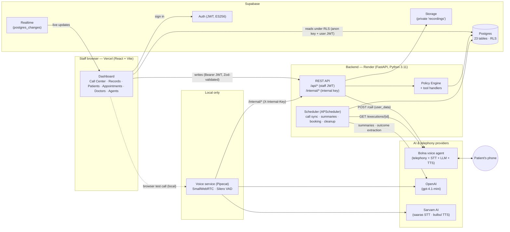
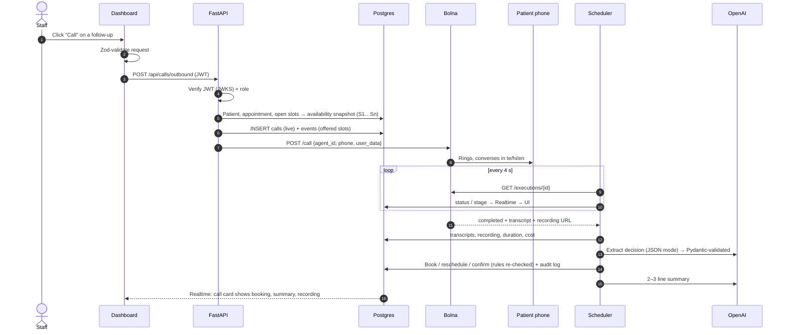

# CareVoice — System Design

Multilingual (Telugu · Hindi · English) AI voice operations for hospitals: AI agents phone patients from the
hospital's records (appointment reminders, missed-appointment follow-ups, post-visit check-ins), offer real
doctor availability, book or reschedule appointments, and return every call to staff with a summary,
transcript and recording.

Contents: [1. User roles](#1-user-roles) · [2. System architecture](#2-system-architecture) ·
[3. Database schema](#3-database-schema) · [4. AI integration](#4-ai-integration) ·
[5. Validation (Zod · Pydantic · JSON Schema · SQL)](#5-validation) ·
[6. Security & secret management](#6-security--secret-management) · [7. Known limitations](#7-known-limitations)

---

## 1. User roles

### Human users (hospital staff)
Staff sign in with **Supabase Auth** (email + password). Each login is linked to one hospital through the
`staff` table, which carries the role.

| Role | Can see (read, via RLS) | Can do (write, via API) |
|---|---|---|
| **admin** | All data of their hospital | Place calls, mark patients arrived, everything reception can do |
| **reception** | All data of their hospital | Place calls (`POST /api/calls/outbound`), mark arrived (`POST /api/appointments/{id}/check-in`) |
| **doctor** | All data of their hospital | Read-only today |
| **viewer** | All data of their hospital | Read-only |

Enforcement:
- **Reads** — PostgreSQL Row-Level Security: every table's policy is
  `tenant_id = current_tenant_id()`, where `current_tenant_id()` resolves the logged-in user's hospital from
  `staff`. A user never sees another hospital's rows; a logged-out request sees nothing.
- **Writes** — FastAPI dependency `require_roles("admin", "reception")` after verifying the user's Supabase
  JWT. The browser has **no** insert/update/delete rights on any table.
- The UI mirrors the roles (e.g. *Mark arrived* only renders for admin/reception), but the API is the
  authority — hiding a button is never the only protection.

### Patients (not users)
Patients never log in. They interact only by phone. On inbound browser/voice calls they are identified by
caller number and **verified** (date of birth / birth year) before any patient-specific action.

### Non-human actors
| Actor | Identity | Allowed to |
|---|---|---|
| **AI agents** (Reception, Appointment, Follow-up, Pre-Visit, Caring, Console) | Rows in `agents` (prompt + `allowed_tools`) | Request tools; every request passes the Policy Engine |
| **Backend API** | Postgres owner via `DATABASE_URL`; Supabase service-role key | All writes, Storage, Auth admin |
| **Voice service** (Pipecat, local) | `X-Internal-Key` shared secret | Call lifecycle + tool calls on `/internal/*` only |
| **Scheduler** (inside the API or `worker.py`) | Same as backend | Background jobs (call sync, summaries, holds cleanup) |

---

## 2. System architecture



### Components
| Component | Tech | Responsibility |
|---|---|---|
| Dashboard | React 19, TypeScript, Vite, Tailwind v4, shadcn/ui, TanStack Query, framer-motion, Zod | Staff UI; reads via supabase-js under RLS; live via Realtime; writes via the API |
| Backend API | FastAPI, SQLAlchemy 2 async + asyncpg, Pydantic v2, PyJWT | Auth, business rules, Policy Engine, Bolna/OpenAI integration |
| Scheduler | APScheduler (in-process on Render via `RUN_SCHEDULER=true`; `worker.py` locally) | Poll Bolna calls, apply outcomes, summaries, release expired slot holds, close stale calls, job queue (`SELECT … FOR UPDATE SKIP LOCKED`) |
| Voice service | Pipecat 1.11, SmallWebRTC, Silero VAD, Sarvam STT/TTS, OpenAI | Real-time browser voice agent with tool calling (local development/demo) |
| Database | Supabase Postgres, Auth, Realtime, Storage | System of record; RLS; live change feed |
| Telephony | Bolna | Places real outbound PSTN calls with the configured voice agent |

### Outbound call lifecycle



---

## 3. Database schema

Source of truth: [`supabase/migrations/20260925120000_core_schema.sql`](../supabase/migrations/20260925120000_core_schema.sql).
Conventions: UUID primary keys, `tenant_id` on **every** table, `created_at`/`updated_at` (trigger-maintained),
timestamps stored in UTC and displayed in Asia/Kolkata, RLS enabled everywhere.

```mermaid
erDiagram
  TENANTS ||--o{ STAFF : employs
  TENANTS ||--o{ DEPARTMENTS : has
  DEPARTMENTS ||--o{ DOCTORS : contains
  TENANTS ||--o{ PATIENTS : registers
  DOCTORS ||--o{ APPOINTMENT_SLOTS : offers
  APPOINTMENT_SLOTS ||--o| APPOINTMENTS : "one active"
  PATIENTS ||--o{ APPOINTMENTS : books
  DOCTORS ||--o{ APPOINTMENTS : sees
  PATIENTS ||--o{ CALLS : "called / calls"
  CALLS ||--o{ CALL_TRANSCRIPTS : contains
  CALLS ||--o{ CALL_EVENTS : logs
  CALLS ||--o{ CALL_METRICS : measures
  CALLS ||--o{ CALL_SESSIONS : verifies
  CALLS ||--o{ AGENT_ACTIONS : "tool calls"
  CALLS ||--o{ ESCALATIONS : raises
  CALLS ||--o| APPOINTMENTS : "booked on"
  TENANTS ||--o{ AGENTS : configures
  WORKFLOW_RULES ||--o{ CALL_TASKS : schedules
  PATIENTS ||--o{ CALL_TASKS : "to call"
  PATIENTS ||--o{ DISCHARGES : has

  TENANTS { uuid id PK; text name; text city; time calling_window_start; jsonb recording_disclosure; jsonb settings }
  STAFF { uuid id PK; uuid tenant_id FK; uuid user_id FK; text role }
  DOCTORS { uuid id PK; uuid department_id FK; text name; text name_te; text name_hi; jsonb schedule; int slot_minutes }
  PATIENTS { uuid id PK; text name; text phone "E.164"; date dob; text preferred_language; bool opt_out; bool dnd }
  APPOINTMENT_SLOTS { uuid id PK; uuid doctor_id FK; timestamptz starts_at; text status; uuid held_by_session; timestamptz held_until }
  APPOINTMENTS { uuid id PK; uuid patient_id FK; uuid slot_id FK; text status; text source; uuid call_id FK }
  CALLS { uuid id PK; text direction; text channel; text provider; text status; text intent; text outcome; text recording_path; jsonb summary }
  CALL_TRANSCRIPTS { uuid id PK; uuid call_id FK; text speaker; text text; text language }
  CALL_EVENTS { uuid id PK; uuid call_id FK; text type; text label; jsonb payload }
  AGENTS { uuid id PK; text type; text display_name; jsonb config "prompt + allowed_tools" }
```

| Area | Tables | Notes |
|---|---|---|
| Tenancy & access | `tenants`, `staff` | `current_tenant_id()` / `current_staff_role()` (SECURITY DEFINER) power RLS |
| Directory | `departments`, `doctors`, `patients` | Telugu + Devanagari names; weekly schedules as JSON; E.164 phone CHECK |
| Scheduling | `appointment_slots`, `appointments` | 14-day rolling slot generation; slot holds with `held_until` (3 min); **partial unique index = one active appointment per slot** |
| Calls | `calls`, `call_sessions`, `call_transcripts`, `call_events`, `call_metrics` | `call_sessions.expires_at` = 30-min verification window |
| Oversight | `agent_actions`, `audit_logs`, `escalations` | Every tool call and every write is recorded |
| Automation | `call_tasks`, `workflow_rules`, `domain_events` (idempotency key), `jobs` | Postgres-backed queue, no Redis |
| Content & quality | `knowledge_articles`, `discharges`, `eval_runs` | Per-language content with approval state |

Realtime publication: `calls`, `call_transcripts`, `call_events`, `escalations`, `call_tasks`, `appointments`.

---

## 4. AI integration

### 4.1 Models and providers
| Purpose | Provider / model | Where |
|---|---|---|
| Phone conversations (outbound) | **Bolna** voice agent (telephony + STT + LLM + TTS) | Bolna cloud, called by the backend |
| Browser conversations | **Pipecat** pipeline: Sarvam `saaras:v3` STT (code-mix) → OpenAI `gpt-4.1-mini` (streaming, tool calling) → Sarvam `bulbul:v3` TTS; Silero VAD | `voice/` service |
| Post-call outcome extraction | OpenAI `OPENAI_SUMMARY_MODEL`, JSON mode | Scheduler (`app/services/post_call.py`) |
| Call summaries | OpenAI `OPENAI_SUMMARY_MODEL` | Scheduler (`app/services/summaries.py`) |

Providers sit behind interfaces (`app/providers/*`) and are selected by environment variables.

### 4.2 Phone agent (Bolna) — context in, decisions out
1. **Context in.** For each call the backend builds `user_data` for the agent prompt:
   `patient_name`, `hospital_name`, `appointment_details` (spoken in the patient's language, e.g.
   "రేపు ఉదయం 10 గంటలకు"), `call_purpose` (reminder / missed / post-visit / booking), and a **live
   availability snapshot** (`availability`, `doctor_count`) — real open slots from the database, each tagged
   `S1…Sn`.
2. **Conversation.** The agent may only offer slots from that list, must read back and get a clear "yes",
   and mirrors the patient's language (Telugu/Hindi/English code-mixing).
3. **Decisions out.** After the call, the transcript and the offered slot list go to OpenAI in JSON mode.
   The reply is validated by the Pydantic model `CallDecision` (`booked_slot_code` must match `^S\d{1,3}$`,
   unknown fields ignored, safe defaults). Only a code that **was offered on that call** can be acted on.
4. **Deterministic execution.** Booking/rescheduling/confirming runs in code, re-checking the rules (slot
   still open, no second active appointment with the same doctor that day). If the slot was taken, an
   escalation is created for staff instead. Every change writes `call_events` + `audit_logs`.

### 4.3 Browser agent (Pipecat) — tool calling through the Policy Engine
- The LLM receives JSON-Schema tool definitions (`verify_patient`, `search_doctors`, `get_available_slots`,
  `hold_slot`, `create_appointment`, `cancel_appointment`, `escalate`, …) for the tools its agent config
  allows.
- Every tool call is an HTTP request to `POST /internal/tools/{name}`; `run_tool` enforces, in order:
  tool exists → call is live → agent is allowed this tool → caller verified (for patient data) → handler
  business rules (future slot, own 3-minute hold, no double booking, cancellation cut-off) → transaction →
  `agent_actions` + `call_events` (+ `audit_logs` for writes).
- The agent receives `{ok, data | error_code, message_for_agent}` and must only state what the tool returned.
- Times are returned in spoken Telugu/Hindi/English forms; the conversation language is the dominant language
  of the last three patient turns and switches the TTS voice language accordingly.

### 4.4 Safety rules for every agent
- **The LLM never touches the database**; it can only propose tool calls or produce text.
- No diagnosis, prescriptions or medical advice; no invented doctors, slots, prices or policies.
- Emergencies (chest pain, breathing trouble, unconsciousness, heavy bleeding, self-harm) → every agent
  prompt instructs: tell the caller to dial 108 and escalate. Emergency keywords per language (incl.
  romanised Telugu/Hindi) are stored in the hospital settings for the automatic detector (planned).
- Recording disclosure is the first line of every browser-agent call (per language, from hospital settings)
  and part of the phone agent's welcome message.

---

## 5. Validation

Data is validated at **every boundary**, so a bad value is stopped before it can cause harm.

| Layer | Tool | What is validated | Where |
|---|---|---|---|
| Browser config | **Zod** | `VITE_*` values are URLs; the Supabase key must be the public anon/publishable key — a `sb_secret_…` or `service_role` JWT is **rejected** and the app falls back to setup mode | `frontend/src/lib/env.ts`, `lib/schemas.ts` (`publicEnvSchema`, `browserSupabaseKey`) |
| Browser → API requests | **Zod** | Outbound call request (UUIDs, purpose enum, phone format, "phone or patient" rule) is parsed before it is sent | `startOutboundCall()` in `lib/api.ts` (`outboundCallRequestSchema`) |
| API → browser responses | **Zod** | Every backend response is parsed (`healthResponseSchema`, `outboundCallResponseSchema`, `checkInResponseSchema`, `apiErrorBodySchema`); an unexpected shape becomes an error, never rendered | `apiFetch(path, schema)` |
| User input | **Zod** | Login (`loginSchema`: email, password length); phone numbers (`phoneInputSchema`: strips spaces/dashes, 10–15 digits) | Login page, Test Call |
| API requests | **Pydantic v2** | Request bodies with enums/`Literal`s and cross-field rules (e.g. `OutboundIn`, `StartCall`, `TranscriptIn`, `ToolIn`); UUID path params; phone → E.164 normalisation | `backend/app/api/*.py`, `app/core/phone.py` |
| Configuration | **Pydantic Settings** | Typed env vars, URL rewriting, Bolna agent ID extracted from a pasted URL | `app/core/config.py` |
| AI output | **Pydantic v2** | `CallDecision` for post-call extraction (strict slot-code pattern, safe defaults) | `app/services/post_call.py` |
| AI tool calls | **JSON Schema** | Tool arguments described per tool; handlers re-check types and rules | `app/services/tools.py` |
| Database | **SQL constraints** | CHECK enums on every status/role/language, E.164 regex on phones, `ends_at > starts_at`, hold consistency, unique `(doctor_id, starts_at)`, partial unique index for one active appointment per slot, FKs | Migration SQL |

---

## 6. Security & secret management

### Secrets
| Secret | Lives in | Never in |
|---|---|---|
| `SUPABASE_SERVICE_ROLE_KEY`, `DATABASE_URL`, `SUPABASE_JWT_SECRET` | `backend/.env` (local), Render secret env vars | Git, frontend, Vercel |
| `OPENAI_API_KEY`, `SARVAM_API_KEY`, `BOLNA_API_KEY` | `backend/.env`, `voice/.env`, Render | Git, frontend, Vercel |
| `INTERNAL_API_KEY` | `backend/.env` + `voice/.env` (random, 43 chars); generated by Render | Git, frontend |
| `VITE_SUPABASE_URL`, `VITE_SUPABASE_ANON_KEY`, `VITE_API_URL` | Vercel (type *Config*) | — these are **public by design**; the anon key only works within RLS |

Measures:
- `.env` files are git-ignored; only `.env.example` templates (empty values) are committed.
- **Repository scan**: every real value from the `.env` files and common key patterns (OpenAI `sk-…`, JWTs,
  `sb_secret_…`, database URLs with passwords) were searched across all files **and the full git history** —
  zero matches. Personal data used in early tests was scrubbed from history before the repo went public.
- **Frontend bundle scan**: the production build was searched for every server-side secret — none present.
- The frontend refuses to start with a privileged Supabase key (Zod guard above) — fail closed.
- `render.yaml` marks secrets `sync: false` (entered in Render's dashboard, never in the file) and
  auto-generates `INTERNAL_API_KEY`.

### Authentication & authorisation
- Staff JWTs are verified on the backend: asymmetric **ES256/RS256 via the project's JWKS** (keys cached for
  1 hour), with HS256 + `SUPABASE_JWT_SECRET` as a legacy fallback; audience `authenticated`, expiry checked.
- Role checks per endpoint (`require_roles`), then the hospital (`tenant_id`) comes from the `staff` row,
  never from the request.
- RLS on all 23 tables; `call_sessions` and `jobs` have no read policy at all (internal only). Verified:
  logged-out REST requests return 0 rows; a logged-in direct `INSERT` via the REST API returns **403**.
- Service-to-service calls use a constant-time compared `X-Internal-Key`.

### Data protection & abuse controls
- CORS restricted to configured origins (`CORS_ORIGINS`) plus an optional regex for Vercel previews.
- Private Storage bucket `recordings`; call recordings from Bolna are stored as provider links on the call.
- Phone numbers normalised to E.164 at the API boundary. A masking helper (`mask_phone` → `+91 ******3210`)
  exists and the seed log masks the test number; masking across all application logs is planned.
- Patients with `opt_out` or `dnd` are excluded from the call queue; demo patients use +91 555… numbers,
  which no Indian mobile uses, so automated calls can never reach a real person by accident.
- Bolna trial accounts can only call verified numbers (enforced by the provider).
- Audit trail: `audit_logs` (who/what/before/after) for every write by staff, agents or the system;
  `agent_actions` for every tool call with its policy decision and latency.

### Secret rotation
Rotate a key at its provider → update it in Render (and local `.env`) → redeploy. The Supabase anon key
rotates the same way in Vercel. No code change is needed for any rotation.

---

## 7. Known limitations

- API rate limiting is not yet implemented (planned: per-IP and per-user limits on `/api/calls/outbound`).
- Emergency handling is prompt-based today; the rule-based keyword detector on every transcript is planned.
- `doctor` and `viewer` roles are read-only today; finer-grained permissions are planned.
- Bolna recordings are provider-hosted links; copying them into the private `recordings` bucket with signed
  URLs is planned.
- The Pipecat browser voice agent runs locally; deploying it publicly needs a TURN server for WebRTC.
- On Render's free plan the backend sleeps after 15 minutes idle; the open dashboard keeps it awake.
